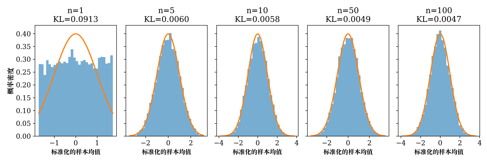
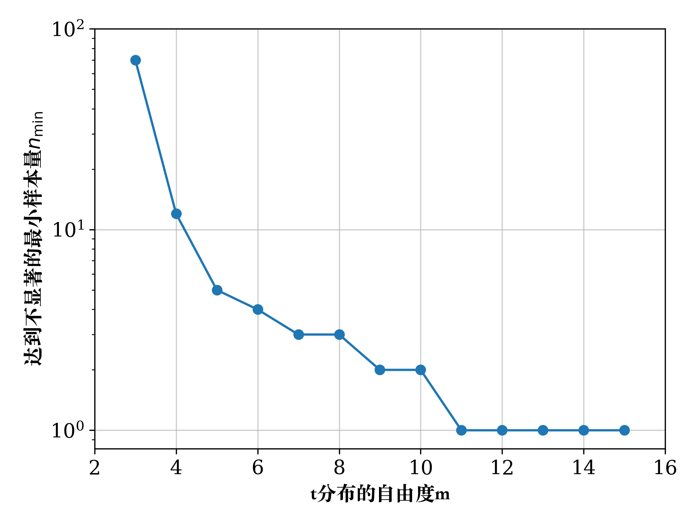
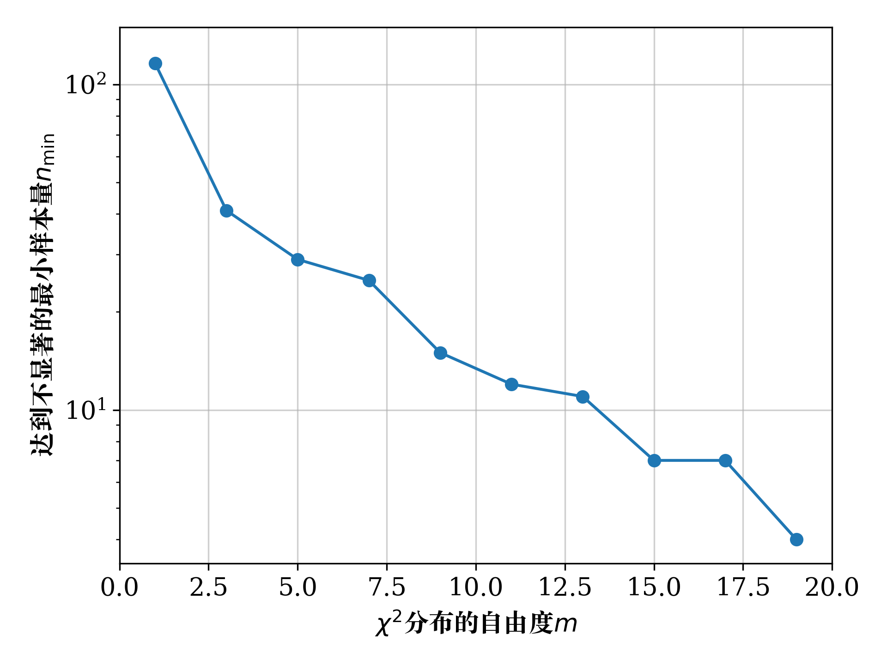
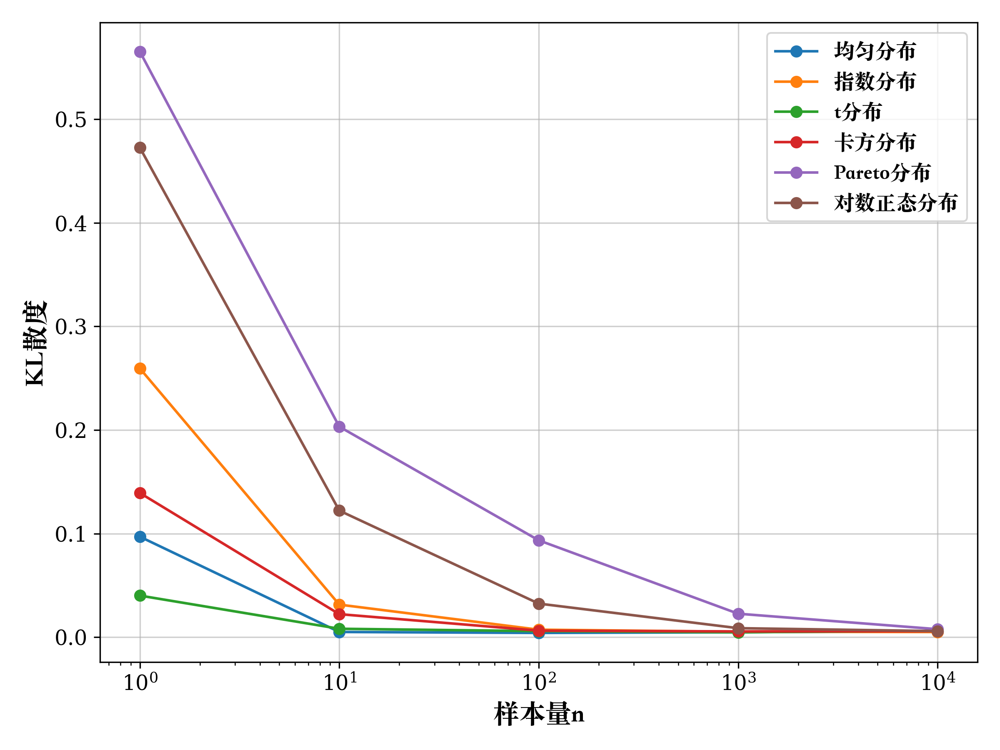

# CLT-Validation-and-Exploration

## Overview / 项目概述
This project explores and validates the **Central Limit Theorem (CLT)** using Python, as part of the coursework for *SJTU-MATH1207H: Probability and Mathematical Statistics*.  
Through metrics such as **KL divergence** to evaluate convergence precision and **KS tests** to determine significance levels, the project delves into the convergence properties of the CLT under various conditions.  

研究聚焦于数理统计的基础性定理——**中心极限定理**，旨在通过编程实践验证其适用性与收敛特性。本项目基于以下方法开展分析：
- 使用 **KL散度** 评估收敛精度；
- 通过 **KS检验** 判断显著性水平。

研究发现，样本量、峰态、偏态以及长尾特性对收敛特性有显著影响。针对不同条件下的分布，分别进行了以下探索：
- 峰态：自由度不同的t分布；
- 偏态：自由度不同的χ²分布；
- 长尾：对数正态分布和Pareto分布。

研究结果不仅深化了对中心极限定理的理解，也为实际数据分析提供了理论支持。

---

## Key Features / 技术亮点
1. **Quantitative Analysis / 定量分析**  
   - Evaluated convergence precision using KL divergence.  
   - Assessed distributional similarity with KS tests.  

2. **Comprehensive Exploration / 全面探究**  
   - Investigated the impact of sample size, kurtosis, skewness, and heavy tails on the CLT's convergence properties.  
   - Explored t-distribution, χ²-distribution, log-normal distribution, and Pareto distribution.  

3. **Visual Interpretations / 直观可视化**  
   - Detailed visualizations for convergence processes under different conditions.
   - Highlighted key differences in CLT applicability.

---

## Results and Figures / 结果与图示
### Figure 1: Sample Size Effects on Convergence 精度
  
Illustrates how larger sample sizes improve the convergence of sample means to the normal distribution.  
样本量的增加使样本均值分布更接近正态分布。

### Figure 2: Kurtosis Impact (t-Distribution)
  
Shows how higher degrees of freedom in the t-distribution accelerate convergence.  
高自由度的t分布收敛速度更快。

### Figure 3: Skewness Impact (χ²-Distribution)
  
Demonstrates how skewness slows down convergence and requires larger sample sizes.  
偏态分布需要更大样本量以实现良好收敛。

### Figure 4: Heavy-Tail Impact (Log-Normal and Pareto Distributions)
  
Compares the slow convergence of log-normal and Pareto distributions due to extreme values in the tails.  
长尾分布中的极端值显著减缓了收敛速度。

---